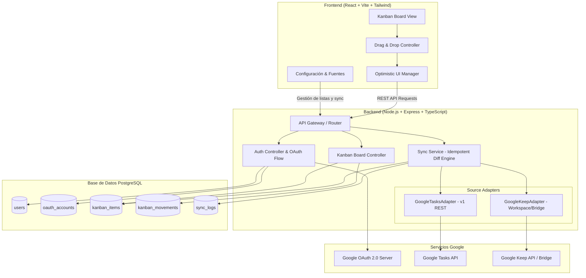
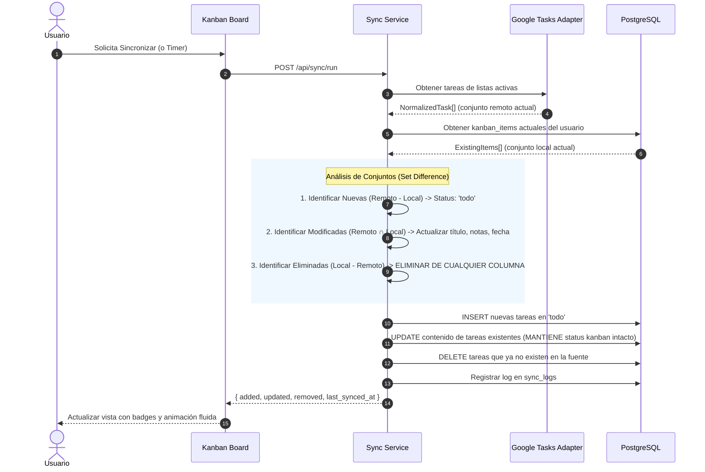

# Arquitectura y Decisiones Técnicas: Kanban Tasks Board

Este documento describe la arquitectura técnica, modelo de datos, evaluación formal de APIs de Google (Tasks y Keep), mecanismo de sincronización idempotente y estrategia de despliegue para la aplicación web **Kanban Tasks Board**.

---

## 1. Principio Fundamental del Sistema

> **La fuente externa (Google Tasks / Google Keep) es la única autoridad sobre la existencia, título, notas y fecha de un ítem.**
> **El Kanban es la autoridad exclusiva sobre el flujo visual de trabajo (columna actual, orden relativo e historial de transiciones).**

Cualquier elemento en el Kanban existe si y solo si existe en la fuente original. Si un elemento es borrado en Google Tasks o Keep, desaparece inmediatamente del Kanban en la siguiente sincronización, sin importar si estaba en *Para hacer*, *En progreso*, *En revisión* o *Terminado*.

---

## 2. Evaluación Técnica Oficial de las APIs de Google

Antes de implementar cualquier integración, se realizó un análisis exhaustivo de las especificaciones REST oficiales de Google:

### 2.1 Google Tasks API v1 (`tasks.googleapis.com`)
* **Disponibilidad**: Abierta para todas las cuentas de Google (tanto personales `@gmail.com` como dominios empresariales de Google Workspace).
* **Flujo de Autenticación**: OAuth 2.0 estándar (Authorization Code Flow con `access_type=offline` y `prompt=consent` para obtener `refresh_token`).
* **Scopes Necesarios**:
  * `https://www.googleapis.com/auth/tasks` (lectura y escritura de tareas y listas).
  * `https://www.googleapis.com/auth/userinfo.email` y `https://www.googleapis.com/auth/userinfo.profile` (identificación del usuario).
* **Capacidades Oficiales**:
  * `tasklists.list`: Listado de listas de tareas disponibles del usuario.
  * `tasks.list`: Obtención de tareas de una lista. Soporta parámetros clave:
    * `showCompleted=true/false`: permite filtrar o incluir tareas completadas.
    * `showDeleted=true/false`: permite detectar qué tareas fueron eliminadas en la fuente para sincronización incremental.
    * `updatedMin`: timestamp ISO-8601 para traer únicamente tareas creadas o modificadas desde la última sincronización.
  * `tasks.patch`: Permite marcar una tarea como completada (`status: "completed"`) en Google Tasks cuando el usuario lo configure en el Kanban al moverla a *Terminado*.
* **Veredicto Técnico**: 100% compatible con todos los requisitos del Kanban.

### 2.2 Google Keep API v1 (`keep.googleapis.com`) — Realidad Técnica y Limitaciones
* **Restricción Fundamental de Google**:
  A diferencia de Google Tasks, Drive o Calendar, **la API oficial de Google Keep NO está habilitada para cuentas de usuario estándar (`@gmail.com`)**.
* **Tipo de Acceso Restringido**:
  * Google exige un entorno empresarial **Google Workspace Enterprise**.
  * La autenticación requiere **Cuentas de Servicio (Service Account) con Delegación de Todo el Dominio (Domain-Wide Delegation)** configuradas por un administrador de Google Workspace.
  * Si una aplicación web solicita los scopes `https://www.googleapis.com/auth/keep` o `https://www.googleapis.com/auth/keep.readonly` con una cuenta personal `@gmail.com`, la pantalla de consentimiento de Google OAuth falla con:
    `400 invalid_scope` o `403 Insufficient authentication scopes`.
* **Propósito Original de la API de Keep**:
  Google diseñó esta API específicamente para aplicaciones de seguridad y cumplimiento normativo corporativo (CASB/DLP), permitiendo auditar y gestionar notas sensibles dentro de la empresa, no para sincronización bidireccional de tareas personales de consumidores.
* **Alternativa Técnica Implementada (Sin inventar endpoints ficticios)**:
  1. **Patrón Adapter Polimórfico (`TaskSourceAdapter`)**: La arquitectura desacopla el origen de los datos a través de una interfaz común.
  2. **GoogleKeepAdapter**:
     - Soporta autenticación nativa para dominios Google Workspace si se proveen credenciales de Service Account empresariales.
     - Para usuarios personales (`@gmail.com`), el sistema detecta el tipo de cuenta y muestra un estado claro y transparente en el panel de configuración:
       *Informa la restricción oficial de Google e instruye cómo Google Tasks es el gestor de tareas nativo unificado de Google.*
     - Soporta un **Keep Ingest Bridge / Importador JSON estructurado de notas de Keep** (formato Google Takeout o listas compartidas), asignando `source: 'google_keep'` y el badge visual correspondiente `[Google Keep]` en las tarjetas del Kanban.

---

## 3. Diagrama de Arquitectura del Sistema



---

## 4. Modelo de Datos (PostgreSQL / Prisma)

### 4.1 Restricción de Identidad
Para garantizar que nunca se confundan dos tareas con el mismo título ni se generen duplicados:
```sql
CONSTRAINT uq_user_source_source_id UNIQUE (user_id, source, source_id);
```

### 4.2 Tablas Principales
* **`users`**: Identidad del usuario autenticado en la plataforma.
* **`oauth_accounts`**: Almacena el `access_token`, `refresh_token` (cifrado) y vencimiento para mantener la sesión y conectividad continua con Google sin solicitar re-login.
* **`user_settings`**:
  * Listas de Google Tasks activas para sincronizar (`selected_task_lists`).
  * Opción booleana `complete_in_source_on_done` (por defecto `false`).
  * Intervalo de sincronización periódica automática (segundos).
* **`kanban_items`**:
  * `id`: UUID (Primary Key).
  * `user_id`: UUID (Foreign Key a `users`).
  * `source`: `google_tasks` | `google_keep`.
  * `source_id`: Identificador original del elemento en Google.
  * `source_list_id` y `source_list_name`: Lista de origen.
  * `title`: Título original.
  * `description`: Notas/contenido.
  * `due_date`: Fecha de vencimiento provista por la fuente.
  * `status`: `todo` | `in_progress` | `review` | `done` (Propiedad exclusiva del Kanban).
  * `position`: Posición flotante para reordenamiento fluido sin renumerar toda la columna.
  * `last_synced_at`: Timestamp de la última verificación con la fuente.
* **`kanban_movements`**: Registro cronológico de movimientos entre columnas (`from_status`, `to_status`, `moved_at`).
* **`sync_logs`**: Auditoría de cada ejecución del motor de sincronización (`items_added`, `items_updated`, `items_removed`, `status`, `error_message`).

---

## 5. Algoritmo de Sincronización Idempotente (Diff Engine)

El motor de sincronización ejecuta los siguientes pasos secuenciales:



### 5.1 Reglas Clave del Sincronizador:
1. **Altas**: Si una tarea no existe localmente, se inserta **únicamente en `todo` ("Para hacer")**.
2. **Modificaciones**: Si cambió el título, descripción o fecha en Google, se actualizan esos campos. El estado del Kanban (`todo`, `in_progress`, `review`, `done`) **permanece intacto**.
3. **Bajas**: Si una tarea local ya no viene en el set de Google Tasks (o fue marcada como `deleted: true`), se borra inmediatamente de la base de datos local, **sin importar en qué columna esté**.
4. **Idempotencia**: Si se ejecuta el proceso N veces seguidas sin cambios remotos, el delta es 0: 0 inserts, 0 updates, 0 deletes.

---

## 6. Drag & Drop y Actualizaciones Optimistas

1. Cuando el usuario arrastra una tarjeta:
   - El frontend actualiza de inmediato el estado visual local en memoria (0ms latencia perceptible).
   - Se emite una petición asíncrona: `PATCH /api/kanban/items/:id/move` con `{ targetStatus, targetPosition }`.
   - Si la opción `complete_in_source_on_done` está activada y la tarjeta se movió a `done`, el backend invoca en background el método `completeTask` en el adaptador de Google Tasks.
2. **Rollback automático ante fallos**:
   - Si la red falla o el backend responde con error (ej. la tarea fue eliminada en Google justo en ese instante), el frontend revierte instantáneamente la tarjeta a su columna anterior y muestra una notificación de error clara.

---

## 7. Seguridad y Privacidad

* **Protección de Credenciales**: Ni el `client_secret` de Google ni los `refresh_token` se exponen jamás al navegador del cliente.
* **Sesiones Seguras**: Cookies HTTP-Only con flags `SameSite=Lax` y `Secure` (en producción), firmadas criptográficamente.
* **Principio de Mínimo Privilegio**: Solo se solicitan los scopes indispensables para operar con Google Tasks.
* **Protección de Datos**: Cada consulta a la base de datos incluye explícitamente el `user_id` de la sesión activa, impidiendo acceso cruzado entre usuarios.
